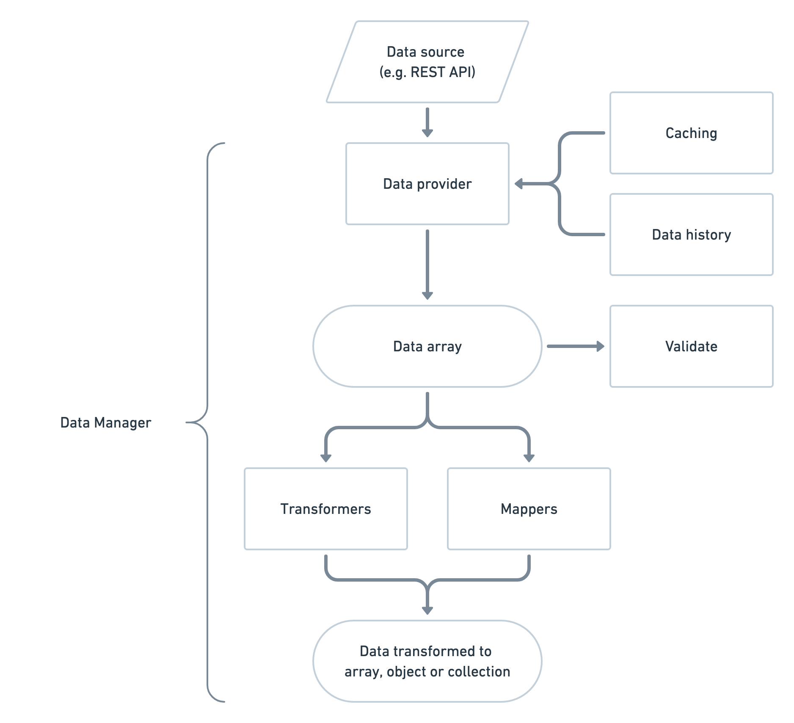

# Principles

_Please note: This section needs updating_

Strata Data offers a standardised way to read and manipulate data from external sources. Its aim is to make working with data easier.

## Architecture

Strata Data has a lightweight architecture.

### Data providers

Data comes from a **Data source**, for example a REST API.

You read data using a **Data provider**, this wraps up data reading functionality along with support for **caching**, decoding raw data, error handling, events and helpers to make development easier.

The data provider layer is custom and has methods that make sense for data retrieval.

**Data history** can be used to help determine if retrieved data has changed since last access.

Once data is returned from the data provider, it's ready to use. If returned data contains multiple values \(e.g. a JSON array\) then it is expected that data is accessible from the data provider as an array.

See [data providers](retrieving-data/data-providers.md), [caching](usage/caching.md) and [data history](advanced-usage/data-history.md).

### Validating data

You can **validate** data to check it is valid. It is recommended to validate source data before it has been modified, this can help when reporting any errors back to the data provider.

See [validating data](usage/validating.md).

### Changing data

Data can be modified via **transformers** or **mappers**. Transformers change data, while mappers map data to a new array or object.

Mappers can also build collections along with automated pagination.

See [changing data](changing-data/changing-data.md).

### Data manager \(TODO\)

You can use data providers, validators, transformers and mappers independently of each other.

You can also wrap all this functionality up in a **Data Manager** which supports an **event system** to allow you to subscribe to events and run custom functionality. There is support for logging and profiling out of the box.

See [data manager](https://github.com/strata/data/tree/19976c714b935c0075e883fa40c47c7fb5c8aa08/docs/data-manager.md) and [events](advanced-usage/events.md).

